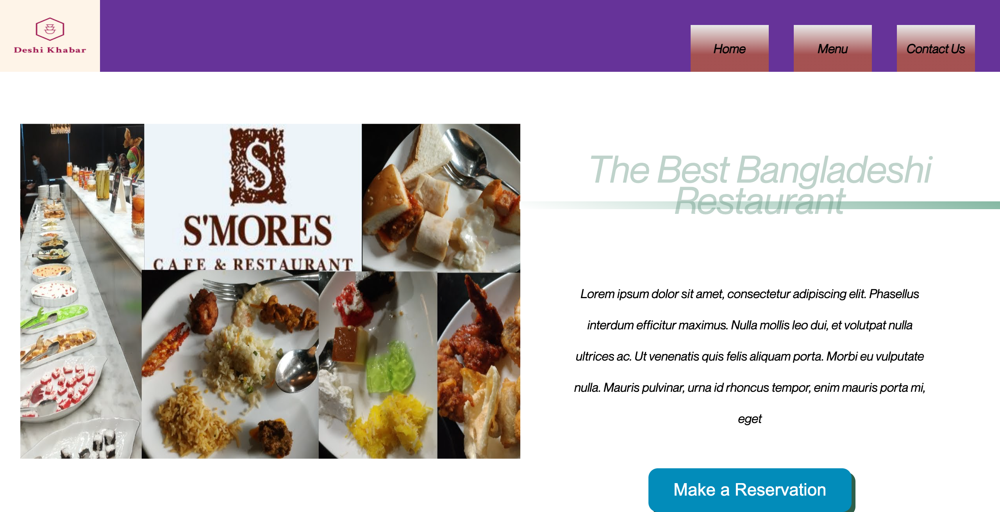
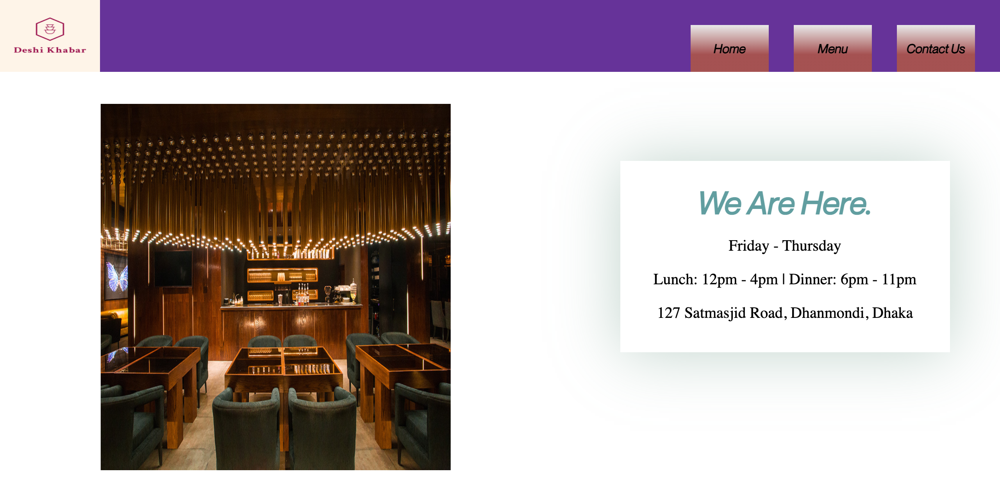
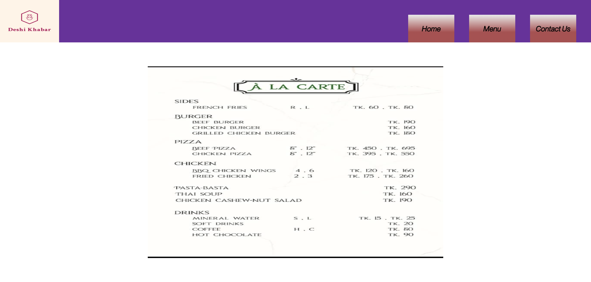

# Restaurant Landing page

>  This project is the practice for DOM manipulation with JavaScript and Webpack. This project is A landing page for a restaurant where you can visit and see the menu that is available on the restaurant, also you can see a map where the restaurant is located.

## Built With

- Webpack
- VS Code
- JavaScript

## Demo Screenshots

## Live Demo

[Live version](https://rawcdn.githack.com/sumon0002001/restaurant_page/b772b49a89aa6dc1c0827caccec014b7ed07d1b7/dist/index.html)

## Prerequisites

node: v12.19.0

## Getting Started
To get a local copy up and running follow these simple example steps.

- Open a terminal or command prompt interface on your PC.
- Clone the repo with: git clone https://github.com/sumon0002001/restaurant_page.git
- On the terminal navigate to the project directory using cd /restaurant_page
- open the folder
- double click index.html
- Here comes the website on the local machine.

## Authors

👤 **Mir Rawshan Ali**

- GitHub: [@sumon0002009](https://github.com/sumon0002001)
- Twitter: [@sumon0002009](https://twitter.com/Sumon0002009)
- LinkedIn: [Mir Rawshan Ali](https://www.linkedin.com/in/mir-rawshan-ali-27b6a5198/)

## 🤝 Contributing

Contributions, issues and feature requests are welcome!

Feel free to check the [issues page](https://github.com/sumon0002001/restaurant_page/issues).

## Show your support

Give a ⭐️ if you like this project!

## :grey_exclamation: Acknowledgments

- Stack Overflow
- Odin Project.

## 📝 License

[MIT LICENSE](LICENSE)
